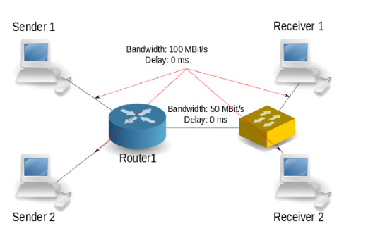

# Rechnernetze Versuch 6 2023.2
##  Messen von Kapazitaet und Bandbreite




The switch is virtualized as a bridge interface on Router1 (switch_bridge)
Bandwidth and delays are set between:
* Sender1 - Router1 (100MBit/s)
* Sender2 - Router1 (100MBit/s)
* Router1 - Switch (50MBit/s)

***Links to the Receivers have no limit, as I don't see any impact.***


### Network:

|Node   |IP    |
|----   |---   |
|Sender1|10.1.0.2|
|Sender2|10.2.0.2|
|Receiver1|10.3.0.2|
|Receiver2|10.4.0.2|
|Router|10.X.0.11|

### Software
* net-tools
* ping
* iperf
* traceroute
* iptables
* iproute2
* ethtool
* sudo
* tcpdump
* netcat
* [***spruce***](https://github.com/brentondwalker/spruce.git)
* [***wbest***](https://github.com/brentondwalker/wbest.git)
* [***DietTopp***](https://github.com/brentondwalker/DietTopp.git)
* [***pathload***](https://github.com/brentondwalker/pathload.git)

***[pathchirp](https://github.com/brentondwalker/pathchirp.git) currently not supported, i cant compile this***

### Commands

launch fresh containers:
```
docker compose up --build -d
```

Stop Containers remove networks
```
docker compose down
```


